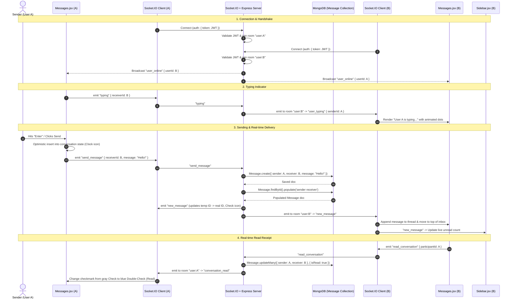

# Real-Time Messaging Feature — End-to-End Architecture (A to Z)

This document provides a comprehensive, step-by-step breakdown of how the **Real-Time Messaging Feature** works in ThesisSphere — from the frontend user interactions to the backend database, WebSockets, REST APIs, and back.

---

## Table of Contents
1. [Architecture Overview & Diagram](#1-architecture-overview--diagram)
2. [Directory & File Map](#2-directory--file-map)
3. [Database Schema (`Message.js`)](#3-database-schema-messagejs)
4. [Authentication & Connection Lifecycle](#4-authentication--connection-lifecycle)
5. [End-to-End Data Flows (A to Z)](#5-end-to-end-data-flows-a-to-z)
   - [Flow A: Connection & Online Presence](#flow-a-connection--online-presence)
   - [Flow B: Loading the Inbox & Active Conversation](#flow-b-loading-the-inbox--active-conversation)
   - [Flow C: Sending a Message (Optimistic UI + Real-Time Delivery)](#flow-c-sending-a-message-optimistic-ui--real-time-delivery)
   - [Flow D: Real-Time Typing Indicators](#flow-d-real-time-typing-indicators)
   - [Flow E: Read Receipts & Global Unread Badges](#flow-e-read-receipts--global-unread-badges)
6. [Detailed File & Function Catalog](#6-detailed-file--function-catalog)
   - [Backend Files & Functions](#backend-files--functions)
   - [Frontend Files & Functions](#frontend-files--functions)
7. [Socket.IO Events Reference](#7-socketio-events-reference)
8. [REST API Endpoints Reference](#8-rest-api-endpoints-reference)

---

## 1. Architecture Overview & Diagram

The messaging architecture uses a **hybrid dual-channel design**:
- **Socket.IO (WebSockets with polling fallback)**: Used for instantaneous message transmission, live typing indicators, presence detection, and read receipts.
- **REST API (Express + MongoDB)**: Used for initial conversation fetching, inbox aggregation, and as an automatic fallback if the WebSocket connection is interrupted.



---

## 2. Directory & File Map

| Layer | File Path | Key Purpose |
| :--- | :--- | :--- |
| **Backend Entry** | `backend/server.js` | Initializes HTTP server, mounts Express middleware, binds Socket.IO, exports `app.set('io', io)`. |
| **Backend Sockets** | `backend/config/socketHandler.js` | JWT socket middleware, room routing (`user:${id}`), online tracking, messaging and WebRTC events. |
| **Backend Controllers** | `backend/controllers/messageController.js` | Handles HTTP message creation, inbox aggregation, conversation history, and mark-as-read logic. |
| **Backend Routes** | `backend/routes/messageRoutes.js` | Protected Express router mapping endpoints to controller actions. |
| **Backend Models** | `backend/models/Message.js` | Mongoose schema defining `sender`, `receiver`, `message`, `isRead`, `attachments`, and timestamps. |
| **Frontend Root** | `frontend/src/App.jsx` | Mounts `SocketProvider` around protected application routes. |
| **Frontend Context** | `frontend/src/context/SocketContext.jsx` | Manages persistent WebSocket connection, online presence set, and socket helper functions. |
| **Frontend UI** | `frontend/src/pages/Messages.jsx` | Full-featured chat UI with real-time thread, inbox list, user directory search, and typing indicators. |
| **Frontend Badge** | `frontend/src/components/Sidebar.jsx` | Listens to socket events and custom window events to update unread message count in real time. |

---

## 3. Database Schema (`Message.js`)

Located in [`backend/models/Message.js`](file:///Users/zihad/ThesisSphere/backend/models/Message.js):

```javascript
const messageSchema = new mongoose.Schema(
  {
    sender: {
      type: mongoose.Schema.Types.ObjectId,
      ref: 'User',
      required: true,
    },
    receiver: {
      type: mongoose.Schema.Types.ObjectId,
      ref: 'User',
      required: true,
    },
    message: {
      type: String,
      required: [true, 'Message cannot be empty'],
    },
    attachments: {
      type: [String],
      default: [],
    },
    isRead: {
      type: Boolean,
      default: false,
    },
  },
  {
    timestamps: true, // Automatically manages createdAt and updatedAt
  }
);
```

---

## 4. Authentication & Connection Lifecycle

1. **Client Handshake**:
   - `SocketProvider` in [`frontend/src/context/SocketContext.jsx`](file:///Users/zihad/ThesisSphere/frontend/src/context/SocketContext.jsx) detects `currentUser.token`.
   - Initializes `io(BACKEND_URL, { auth: { token } })`.
2. **Server-Side Token Verification**:
   - In [`backend/config/socketHandler.js`](file:///Users/zihad/ThesisSphere/backend/config/socketHandler.js), an `io.use(...)` authentication guard intercepts the connection.
   - It decodes the JWT with `jwt.verify(token, process.env.JWT_SECRET)`.
   - It queries MongoDB for the `User` document and attaches `socket.user = { _id, fullName, email, role }` directly to the socket.
3. **Room Allocation**:
   - Upon connection, the socket automatically joins:
     - `socket.join(userId)`
     - `socket.join("user:" + userId)`
   - Any message or notification directed to this user is emitted to room `"user:" + userId`.
4. **Presence Tracking**:
   - The server maintains `userSockets = new Map<userId, Set<socketId>>()`.
   - When a user's first socket connects, the server emits `user_online` to all connected clients.
   - When the user's last socket disconnects, the server emits `user_offline`.

---

## 5. End-to-End Data Flows (A to Z)

### Flow A: Connection & Online Presence
1. User logs in. `App.jsx` stores `currentUser` in state and `localStorage`.
2. `SocketProvider` instantiates the socket connection.
3. Server emits `'online_users'` containing an array of currently online user IDs.
4. `SocketContext` stores these IDs in an `onlineUsers` set.
5. In `Messages.jsx`, users with IDs matching `onlineUsers.has(userId)` receive a vibrant green indicator dot.

### Flow B: Loading the Inbox & Active Conversation
1. **Inbox Retrieval (`GET /api/messages/inbox`)**:
   - `messageController.getInbox` executes an aggregation pipeline on `Message`:
     - Filters messages where the user is either `sender` or `receiver`.
     - Groups by the counterpart user (`otherUser`).
     - Extracts the latest message, timestamp, unread flag, and populates the counterpart's user info via `$lookup`.
     - Returns the sorted inbox list.
2. **Active Conversation Retrieval (`GET /api/messages/conversation/:participantId`)**:
   - User clicks a contact in the inbox or directory.
   - `openConversation(participant)` fetches all messages between the logged-in user and the selected user sorted by `createdAt: 1`.
   - Calls `readConversation(participantId)` via socket and sends `PATCH /api/messages/conversation/:participantId/read` via REST.
   - All unread messages are marked `isRead = true`.

### Flow C: Sending a Message (Optimistic UI + Real-Time Delivery)
1. User types in the input field in `Messages.jsx` and hits `Enter`.
2. **Optimistic Rendering**:
   - An optimistic message object is created with `_id: "temp_" + Date.now()` and `isPending: true`.
   - It is appended to `conversation` state immediately. A spinning `Clock` icon is displayed.
   - The input box is cleared with zero lag.
3. **Transmission**:
   - `Messages.jsx` calls `sendSocketMessage({ receiverId, message })`.
   - The socket emits event `'send_message'` to the backend.
4. **Persistence & Population**:
   - The server creates a MongoDB document via `Message.create(...)`.
   - It re-fetches and populates `sender` and `receiver` details.
5. **Broadcasting**:
   - Server emits `'new_message'` to `io.to("user:" + receiverId)` and `io.to("user:" + senderId)`.
6. **Recipient UI Update**:
   - If User B has User A's chat open:
     - The message is appended to User B's `conversation` state.
     - User B's client automatically triggers `readConversation(A)`.
   - If User B has another chat open (or is on another page):
     - The inbox updates with the new message and displays an unread `"NEW"` badge.
     - `Sidebar.jsx` catches the event and increments the unread badge count.
7. **Sender UI Confirmation**:
   - Sender receives `'new_message'`, replacing the temporary optimistic item with the confirmed DB record. The `Clock` icon changes to a `Check` icon.

### Flow D: Real-Time Typing Indicators
1. As User A types, `handleInputChange` checks if `userIsTypingRef.current` is false.
2. It sets it to true and calls `emitTyping(receiverId)`.
3. The server forwards `'user_typing'` to `receiverId`.
4. User B's UI detects `'user_typing'` and displays an animated 3-dot bubble: `"User A is typing..."`.
5. A debounce timer (2000ms) on User A's client fires `emitStopTyping(receiverId)` when typing pauses, or immediately upon message submission.
6. User B's UI hides the typing animation.

### Flow E: Read Receipts & Global Unread Badges
1. When User B opens User A's conversation, `socket.emit('read_conversation', { participantId: A })` is called.
2. The server executes `Message.updateMany({ sender: A, receiver: B, isRead: false }, { $set: { isRead: true } })`.
3. The server emits `'conversation_read'` to `user:A`.
4. User A's UI receives `'conversation_read'` and updates the message status in the active thread from single check (`Delivered`) to blue double-check (`Read`).
5. A custom event `update_unread_messages` is dispatched to the window, notifying `Sidebar.jsx` to immediately refresh unread message badges.

---

## 6. Detailed File & Function Catalog

### Backend Files & Functions

#### 1. [`backend/server.js`](file:///Users/zihad/ThesisSphere/backend/server.js)
- `io = new SocketIOServer(server, { cors: { origin: '*' } })`: Initializes the WebSocket server instance.
- `initializeSocket(io)`: Hands off socket signaling and event registration to `socketHandler.js`.
- `app.set('io', io)`: Exposes the `io` instance to Express `req.app.get('io')` so REST controllers can trigger socket events.

#### 2. [`backend/config/socketHandler.js`](file:///Users/zihad/ThesisSphere/backend/config/socketHandler.js)
- `initializeSocket(io)`: Core WebSocket entry point.
- `io.use(async (socket, next))`: Authenticates socket connection via JWT header in `socket.handshake.auth.token`.
- `socket.on('connection')`: Joins user rooms and manages active socket connections in `userSockets`.
- `socket.on('send_message', async ({ receiverId, message }, callback)`:
  - Validates inputs.
  - Persists message to MongoDB.
  - Emits `'new_message'` to `user:${receiverId}` and `user:${senderId}`.
  - Executes callback with `{ success: true, data }`.
- `socket.on('typing', ({ receiverId })`: Relays `'user_typing'` with sender ID and name to receiver's room.
- `socket.on('stop_typing', ({ receiverId })`: Relays `'user_stop_typing'` to receiver's room.
- `socket.on('read_conversation', async ({ participantId }, callback)`:
  - Updates all unread messages from `participantId` to `socket.user._id`.
  - Emits `'conversation_read'` to `participantId`'s room.
- `socket.on('mark_read', async ({ messageId }, callback)`: Marks single message as read and notifies sender.
- `socket.on('disconnect')`: Cleans up user presence. If the user has no remaining active sockets, broadcasts `'user_offline'`.

#### 3. [`backend/controllers/messageController.js`](file:///Users/zihad/ThesisSphere/backend/controllers/messageController.js)
- `sendMessage(req, res, next)`:
  - Validates `receiver` and `message` body.
  - Saves `Message` in MongoDB.
  - Emits `'new_message'` via `req.app.get('io')` to both participants.
- `getConversation(req, res, next)`:
  - Queries `Message` where `sender = userId AND receiver = participantId` OR vice versa.
  - Sorts ascending by `createdAt`.
  - Populates sender and receiver info.
- `getInbox(req, res, next)`:
  - Aggregates messages to return the most recent message per counterpart user.
  - Populates participant profiles and computes unread counts.
- `markAsRead(req, res, next)`:
  - Marks an individual message as read (verifying current user is the receiver).
  - Emits `'message_read'` to sender.
- `markConversationAsRead(req, res, next)`:
  - Bulk updates `isRead: true` for all messages from `participantId` to current user.
  - Emits `'conversation_read'` to `participantId`.

#### 4. [`backend/routes/messageRoutes.js`](file:///Users/zihad/ThesisSphere/backend/routes/messageRoutes.js)
- `POST /api/messages`: `protect` -> `sendMessage`
- `GET /api/messages/inbox`: `protect` -> `getInbox`
- `GET /api/messages/conversation/:participantId`: `protect` -> `getConversation`
- `PATCH /api/messages/conversation/:participantId/read`: `protect` -> `markConversationAsRead`
- `PATCH /api/messages/:id/read`: `protect` -> `markAsRead`

---

### Frontend Files & Functions

#### 1. [`frontend/src/context/SocketContext.jsx`](file:///Users/zihad/ThesisSphere/frontend/src/context/SocketContext.jsx)
- `SocketProvider({ currentUser, children })`:
  - Instantiates `io(...)` when `currentUser.token` is available.
  - Handles reconnect attempts and clean teardowns on logout.
  - Subscribes to `'online_users'`, `'user_online'`, and `'user_offline'`.
- `useSocket()`: Custom hook returning `{ socket, isConnected, onlineUsers, emitTyping, emitStopTyping, sendSocketMessage, readConversation }`.
- `sendSocketMessage({ receiverId, message })`: Wraps `socket.emit('send_message', ...)` in a promise with callback acknowledgement.
- `emitTyping(receiverId)` / `emitStopTyping(receiverId)`: Emits typing status events.
- `readConversation(participantId)`: Emits `'read_conversation'`.

#### 2. [`frontend/src/pages/Messages.jsx`](file:///Users/zihad/ThesisSphere/frontend/src/pages/Messages.jsx)
- `fetchInbox()`: Calls `GET /api/messages/inbox` to refresh the left-side conversation list.
- `fetchAllUsers()`: Calls `GET /api/users` for directory searching.
- `openConversation(participant)`:
  - Sets active conversation state.
  - Fetches message history via `GET /api/messages/conversation/:id`.
  - Dispatches read notifications via socket and REST.
  - Clears unread badge on local inbox.
- `handleInputChange(e)`: Handles text input, starts typing debounce, emits typing events.
- `handleSendMessage(e)`:
  - Optimistically appends new message with pending status.
  - Clears text box.
  - Sends via socket (`sendSocketMessage`) with REST fallback (`fetch('/api/messages')`).
- `handleKeyDown(e)`: Sends message on `Enter` (without `Shift`).
- `scrollToBottom(smooth)`: Keeps viewport pinned to latest messages.

#### 3. [`frontend/src/components/Sidebar.jsx`](file:///Users/zihad/ThesisSphere/frontend/src/components/Sidebar.jsx)
- `fetchCounts()`: Queries `GET /api/dashboard/counts` to retrieve current unread messages count.
- Event Listeners:
  - `socket.on('new_message')`: Re-fetches counts instantly when any message arrives.
  - `socket.on('conversation_read')`: Re-fetches counts when messages are marked as read.
  - `window.addEventListener('update_unread_messages')`: Listens for local read actions from the Messages view.

---

## 7. Socket.IO Events Reference

| Event Name | Direction | Payload | Description |
| :--- | :--- | :--- | :--- |
| `send_message` | Client -> Server | `{ receiverId, message, attachments? }` | Client sends a message. Server persists and responds via ack callback. |
| `new_message` | Server -> Client | `Populated Message Object` | Broadcasted to both receiver's room (`user:receiverId`) and sender's room (`user:senderId`). |
| `typing` | Client -> Server | `{ receiverId }` | Informs server that user is typing to `receiverId`. |
| `stop_typing` | Client -> Server | `{ receiverId }` | Informs server that user stopped typing. |
| `user_typing` | Server -> Client | `{ senderId, senderName }` | Delivered to receiver to trigger typing bubble. |
| `user_stop_typing` | Server -> Client | `{ senderId }` | Delivered to receiver to dismiss typing bubble. |
| `read_conversation` | Client -> Server | `{ participantId }` | Informs server that user has read all messages from `participantId`. |
| `conversation_read`| Server -> Client | `{ readerId, participantId, count }` | Notifies original sender that their messages have been read. |
| `mark_read` | Client -> Server | `{ messageId }` | Marks single message as read. |
| `message_read` | Server -> Client | `{ messageId, readerId }` | Delivered to sender confirming individual message read. |
| `online_users` | Server -> Client | `Array<userId>` | Sent on connection; list of all currently connected users. |
| `user_online` | Server -> Client | `{ userId }` | Broadcasted when a user establishes their first active socket connection. |
| `user_offline` | Server -> Client | `{ userId }` | Broadcasted when a user disconnects their last active socket connection. |

---

## 8. REST API Endpoints Reference

### 1. `POST /api/messages`
- **Purpose**: Fallback / direct API message dispatch.
- **Headers**: `Authorization: Bearer <token>`, `Content-Type: application/json`
- **Body**: `{ "receiver": "userId", "message": "Text content" }`
- **Response**: `{ "success": true, "data": { ...populatedMessage } }`

### 2. `GET /api/messages/inbox`
- **Purpose**: Fetches the user's latest message conversations.
- **Headers**: `Authorization: Bearer <token>`
- **Response**: `{ "success": true, "count": N, "data": [ { participant, lastMessage, isRead, createdAt } ] }`

### 3. `GET /api/messages/conversation/:participantId`
- **Purpose**: Fetches complete message history between authenticated user and `participantId`.
- **Headers**: `Authorization: Bearer <token>`
- **Response**: `{ "success": true, "count": N, "data": [ ...messages ] }`

### 4. `PATCH /api/messages/conversation/:participantId/read`
- **Purpose**: Marks all unread messages from `participantId` as read.
- **Headers**: `Authorization: Bearer <token>`
- **Response**: `{ "success": true, "updatedCount": N }`

### 5. `PATCH /api/messages/:id/read`
- **Purpose**: Marks a single message by ID as read.
- **Headers**: `Authorization: Bearer <token>`
- **Response**: `{ "success": true, "data": { ...message } }`

---

## Summary
With this architecture:
- Messages update **instantly** for both parties with 0 page reloads.
- Senders see **optimistic feedback** with message delivery status (`Clock` -> `Check` -> `Double-Check`).
- **Typing indicators** and **presence dots** keep the conversation feeling alive and responsive.
- If the WebSocket connection experiences any transient interruption, the system seamlessly falls back to HTTP REST endpoints without dropping messages.
